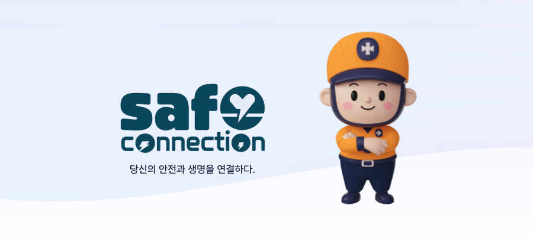
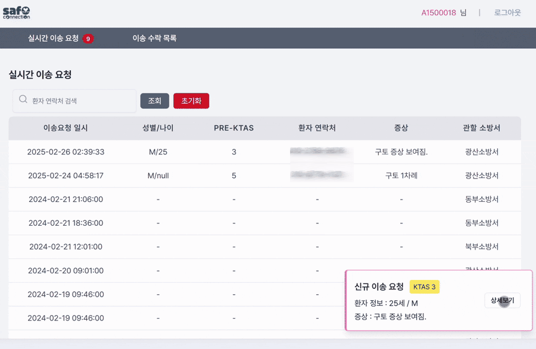

# 🚑 Safe Connect - 통합 응급의료 솔루션

## 프로젝트 소개
119 구급대원이 도착 전에도 의료 지도를 받고 싶으신가요?   응급실에서 신속한 처치를 받고 싶으신가요?
이제 Safe Connect로 걱정을 덜어보세요!   실시간 영상통화와 의료정보 전달로 더 빠르고 정확한 응급처치가 가능합니다 😊

## 📆 프로젝트 기간
2025.01.13 ~ 2025.02.21 (6주)

## 💡주요 기능
**영상통화 기능** 
- 119 신고접수와 동시에 상황실과 영상통화 연결
- 현장 상황을 실시간으로 공유하며 응급 처치 지도
- 현장 영상 정보를 기반으로 적절한 상황 파악 및 출동 결정

**실시간 위치 공유**
- 신고자의 정확한 위치 정보 공유
- 가장 가까운 119구급대의 신속한 출동
- 구급팀 실시간 위치 전송

**의료정보 관리**
- 사전에 기저질환, 복용약물 등 의료정보 등록
- 응급상황 시 119과 병원에 즉시 공유
- 119구급대원의 현장 처치와 병원 이송 시 활용

**보호자 알림**
- 119 신고 접수 및 병원 이송 시 보호자 알림 전송
- 신고자 위치, 이송 병원 정보 공유
- 실시간 응급 상황 정보 전달

**Pre-KTAS AI 분류**
- 중증도 분류의 어려움을 AI로 보조
- 119와 병원 간의 원활한 의사소통에 도움

## 🔧 기술스택
### Backend

### Frontend

### CI/CD & Infrastructure
 

 

### Development Tools
 

 
 
 
 

## 👨‍👩‍👧‍👦 팀원 소개
| 김민철| 김성준 | 박찬미| 박성욱 | 최유정 |
|------|-------|-----|-----|-----|
| Leader / Back End | Back End, CI/CD | Back End | Front End | Front End |

## 🔶 프로젝트 산출물
- [요구사항 명세서](https://www.notion.so/176142f4138080cdb62cc1bec89ed837)
- [API 명세서](https://www.notion.so/API-176142f41380801ab424d9ada4cc88e3)
- [ERD](./docs/ERD.png)
- [WireFrame](docs/wireFrame.md)
- [MockUp](docs/Mockup.md)
- [Story Board](docs/StoryBoard.pdf)
- [Architecture](docs/image/%EC%95%84%EC%B9%B4%ED%85%8D%EC%B3%90.png)
- [최종 발표 PPT](docs/12%EA%B8%B0_%EA%B3%B5%ED%86%B5PJT_%EB%B0%9C%ED%91%9C%EC%9E%90%EB%A3%8C_C207.pdf)

## 🖥️ 화면 구성
## 일반 회원 
1. 회원가입 및 로그인
2. 개인정보 수정
3. 의료정보 수정
4. 비밀번호 변경
5. 이메일 찾기
6. 비밀번호 찾기

## 상황실
### 1. 영상통화 생성하기
- 신고자의 전화번호를 입력하여 영상통화 생성
- 영상통화 URL을 신고자에게 문자로 전송

### 2. 신고 내용 텍스트화 및 AI 요약
- 신고자와의 대화내용을 텍스트화 후 AI를 통해 요약

### 3. 출동 지령
- 신고자 위치 확인
- 신고자 인근 구급팀 필터링 후 출동 지령 내리기
- 출동 지령 후 통화 종료

## 구급대원
### 1. 구급대원 출동 지령 페이지
- 출동 지령 알림 후 영상통화 참여
- 상황실에서 환자 정보 전달받음
- pre-KTAS 분류 AI 보조

### 2. 병원 이송 일괄 요청
- 환자 위치 기준으로 거리 범위로 병원 탐색
- 가용가능한 응급실을 필터링하여 제공

## 병원
### 1. 이송 요청 수락
- 이송 요청 수락 및 수락한 이송 보기
