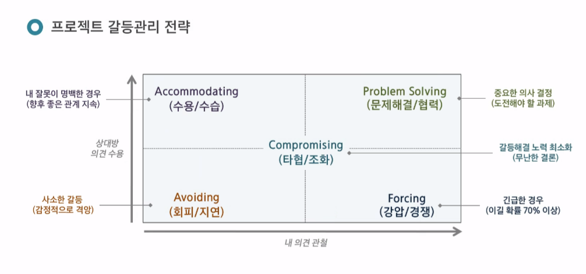
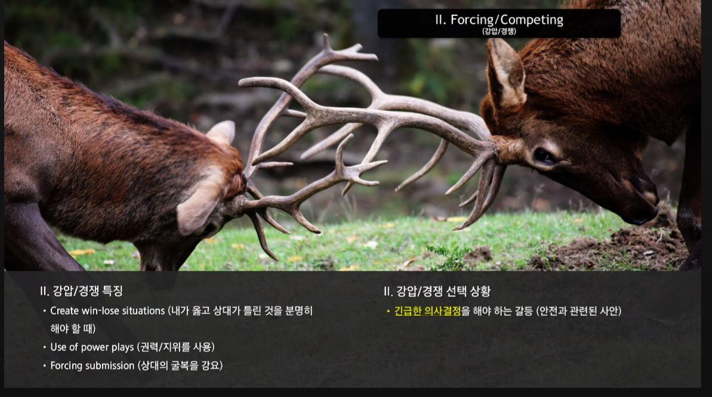
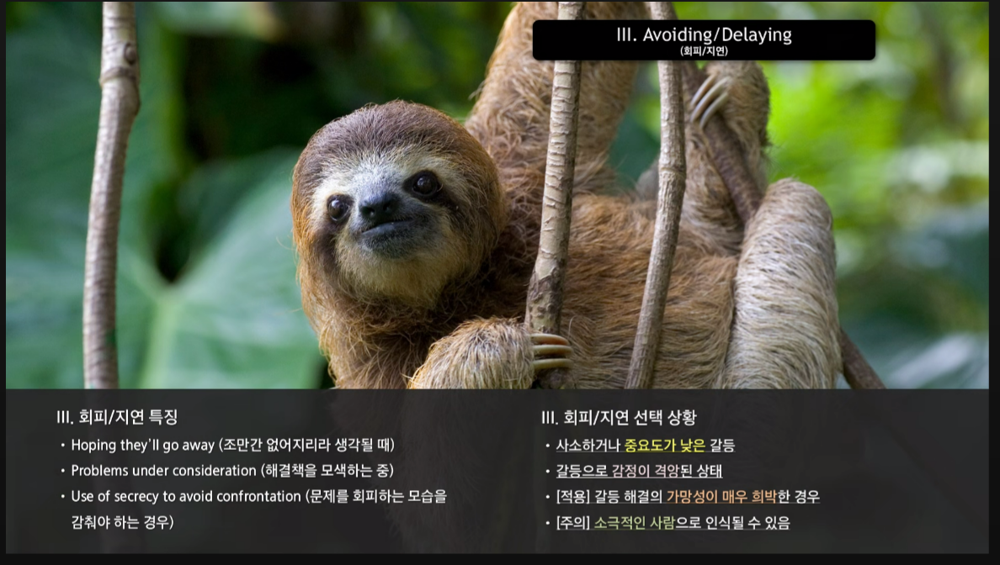
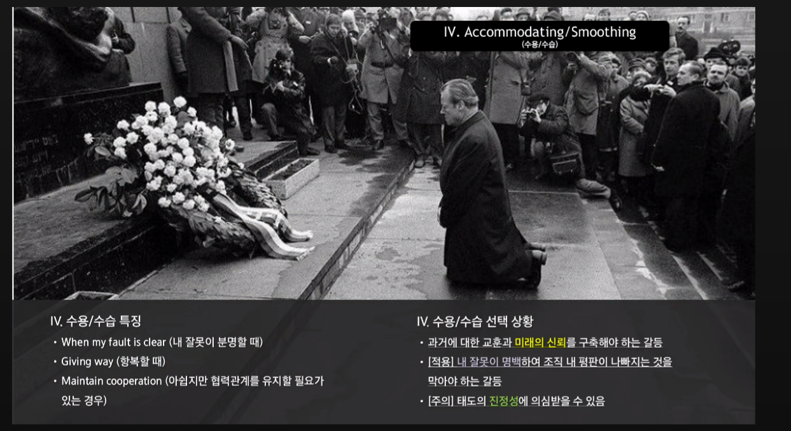

# 김민철

## 20250113

    

    <b>왜 Spring Boot을 사용하는가?</b>
    

<ul>
    <li>
    Spring VS Spring Boot
    </li>
    

둘다 Java 웹 개발 프레임워크이다. 
    Spring은 설정을 개발자가 직접 작성하여 스프링 컨테이너를 구성하고, 필요한 bean객체를 등록하고, 빈 객체간의 의존성을 설정한다.Spring은 특정 구성을 위해 추가적인 라이브러리와 설정이 필요하다. 
    But, Spring Boot는 보다 쉽게 사용할 수 있도록 만든 프레임워크이다. Spring MVC, 스프링 Data JPA, 스프링 Security 등 다양한 기능을 자동으로 설정하며, 개발자가 별도로 설정 파일을 작성하지 않아도 된다. 
    

    
</ul>

   

<b>Spring Boot JPA(Java Persistance API)를 왜 사용하는가?</b>

<ul>
<li>
    

    Java ORM 기술 표준으로 사용하는 인터페이스 모음이다.

1. **JPA는 반복적인 CRUD SQL을 처리**해준다.
   JPA는 매핑된 관계를 이용해 SQL을 생성하고 실행한다.
   MyBatis를 이용하면 **간단한 CRUD 쿼리를 모두 작성**해줘 생산성을 높일 수 있다.

2. **객체 중심으로 개발이 가능**하다.
   JPA를 활용하면 SQL이 아닌 객체 중심으로 개발할 수 있다.
   테이블에 매핑되는 클래스를 더 객체 지향적으로 개발할 수 있다.
   **객체 지향 언어인 Java**에 더 적합하고, **생산 및 유지보수에 수월**하다.

</li>
</ul>

## 20250114

    

        <b>왜 PjM을 해야하는가?</b>
    

    <ul>
        <li>
            <b>Project Manager의 역할 : </b>  
            

               <b>1. 일이 되게 하는 사람(기획자)</b>   프로젝트의 A~Z까지의 모든 프로세스와 이해관계자의 이해를 바탕으로 프로젝트를 수행한다. 개인 업무별 그리고 전체 프로젝트의 일정 관리책임을 가지고 있다.  
               <b>2. 멤버를 어울리게 하는 사람(조율자)</b>   동료들의 문제를 진단/파악하고 가시화하여 함께 문제를 해결할 수 있도록 지원한다.   
               <b>3. 잠재적 위험을 미리 접근하는 사람(선발대)</b>   잠재적 위험을 조기에 파악하고, 가능한 영향을 분석하며, 완화할 전략을 개발한다. 프로젝트 일정, 품질 및 예산에 대한 중단을 최소화한다.   
               <b>4. 프로젝트 예산을 감리하는 사람(회계사)</b>  가능한 모든 비용을 추산하고, 예산을 수립하고, 지출을 추적하며, 재정적 효율성을 달성하고 재정적 범위 내에 있도록 조정한다.  
               <b>5. 품질 기준 유지하는 사람(기준!!!)</b>   프로젝트의 시작부터 완성까지 완성도의 중심을 잡고 잘 유지해줘야한다.  
            

        </li>
        <li>
            <b>갈등관리 전략</b>  
            

             
             
             
             
             
            

        </li>
    </ul>

## 20250115

    

        <b>Spring Security를 왜 사용할까?</b>
    

    인증, 권한 관리 그리고 데이터 보호 기능을 포함하여 웹 개발 과정에서 필수적인 사용자 관리 기능을 구현하는 데 도움을 주는 Spring의 강력한 프레임워크입니다. 
     1. 아키텍처
    <ol>
        <li>사용자의 요청이 서버로 들어온다.</li>
        <li>Authentication Filter가 요청을 가로채고 Authentication Manager로 요청을 위임한다.</li>
        <li>Authentication Manager는 등록된 Authentication Provider를 조회하며 인증을 요구한다.</li>
        <li>Authentication Provider가 실제 데이터를 조회하여 UserDetails 결과를 돌려준다.</li>
        <li>결과는 SecurityContextHolder에 저장되어 저장된 유저 정보를 Spring Controller에서 사용할 수 있게 된다.</li>
    </ol>
     2. 내부 구조
    <ol>
        <li>사용자가 자격 증명 정보를 제출하면, AbstractAuthenticationProcessingFilter가 Authentication 객체를 생성합니다.</li>
        <li>Authentication 객체가 AuthenticationManager에게 전달됩니다.</li>
        <li>인증에 실패하면, 로그인된 유저 정보가 저장된 SecurityContextHolder의 값이 지워지고 RememberMeService.joinFail()이 실행됩니다. 그리고 AuthenticationFailureHandler가 실행됩니다.</li>
        <li>Authentication Provider가 실제 데이터를 조회하여 UserDetails 결과를 돌려준다.</li>
        <li>인증에 성공하면, SessionAuthenticationStrategy가 새로운 로그인이 되었음을 알리고, Authentication이 SecurityContextHolder에 저장됩니다. 이후 SecurityContextPersistenceFilter가 SecurityContext를 HttpSession에 저장하면서 로그인 세션 정보가 저장됩니다.</li>
        <li>그 뒤로 RememberMeServices.loginSuccess()가 실행됩니다. ApplicationEventPublisher가 InteractiveAuthenticationSuccessEvent를 발생시키고 AuthenticationSuccessHandler가 실행됩니다.</li>
    </ol>
 3. 사용 방법 예시
<ol>
    <li>
        Spring Security를 프로젝트에 추가하려면, 필요한 의존성을 추가해야 합니다.
        <pre><code class="language-java">
// https://mvnrepository.com/artifact/org.springframework.boot/spring-boot-starter-security
implementation 'org.springframework.boot:spring-boot-starter-security'
// security 관련 bundle 추가. 버전 맞추기 힘들어 뒤에 (:버전 추가 x)
        </code></pre>
    </li>
    <li>
        허용할 출처, HTTP 메서드, 사용할 헤더, 인증 정보를 허용할 것인지 등을 설정합니다.
    </li>
    <li>
        CORS 설정을 추가하여 외부 도메인에서의 요청을 허용할 수 있습니다.
         예: `configuration.setAllowedOriginPatterns(List.of("*"));` → **어디서든 요청이 들어오면 허용하겠다.**
         Spring Security의 CORS 설정을 통해, Cross-Origin 요청을 처리할 수 있습니다. CORS는 기본적으로 웹 브라우저에서 다른 도메인으로 요청을 보내는 것을 제한하는 보안 기능입니다. 이를 설정함으로써 API와 프론트엔드가 서로 다른 도메인에 있을 때 발생하는 CORS 오류를 방지할 수 있습니다.
    </li>
    <li>
        `SecurityFilterChain`을 사용하여 HTTP 요청을 처리하는 보안 필터 체인을 설정합니다. 
        <pre><code class="language-java">
http.cors(httpSecurityCorsConfigurer -> 
    httpSecurityCorsConfigurer.configurationSource(corsConfigurationSource()));
        </code></pre>
         **설명**: `SecurityFilterChain`은 HTTP 요청에 대한 보안을 처리하는 Spring Security의 핵심 클래스입니다. 위의 설정을 통해 `CORS`를 설정하고, 다른 보안 필터들도 필요에 맞게 추가할 수 있습니다.
  authorizeHttpRequests를 활용해 들어갈 수 있는 url에 역할에 따라 제한을 건다거나, formLogin을 활용해 입력하는 란을 만들 수 있습니다.
    </li>
    <li>
        BCrypt를 사용한 비밀번호 암호화 설정합니다.
        <pre><code class="language-java">
@Bean
public PasswordEncoder passwordEncoder() {
    return new BCryptPasswordEncoder();
}
        </code></pre>
         **설명**: 비밀번호를 안전하게 저장하려면 암호화가 필수입니다. `BCryptPasswordEncoder`는 비밀번호를 암호화할 때 널리 사용되는 알고리즘으로, 반복적인 해싱을 통해 암호화하여 강력한 보안을 제공합니다.
    </li>
    <li>
        CSRF 보호를 비활성화하려면, `http.csrf(AbstractHttpConfigurer::disable);`를 사용합니다. REST API 환경에서 자주 사용됩니다.
         **설명**: CSRF(Cross-Site Request Forgery)는 공격자가 사용자의 의도와 상반되는 요청을 보낼 수 있는 공격입니다. Spring Security에서는 기본적으로 CSRF 보호가 활성화되어 있지만, REST API 환경에서는 세션 기반이 아닌 토큰 기반 인증을 사용하기 때문에 CSRF 보호를 비활성화하는 경우가 많습니다.
    </li>
</ol>

